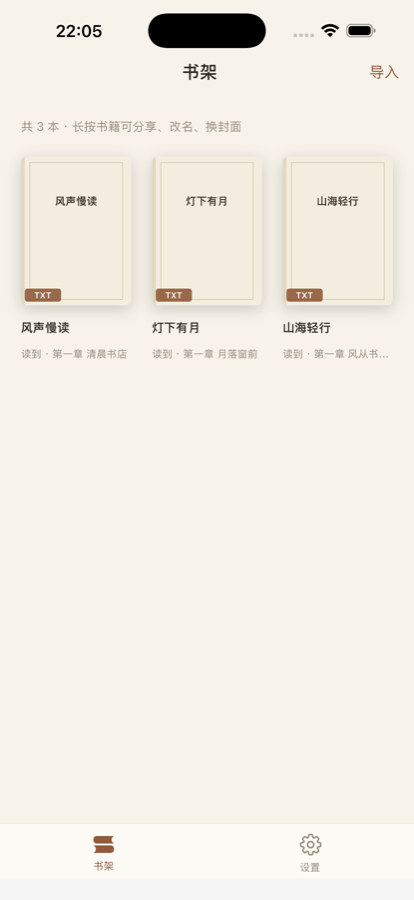
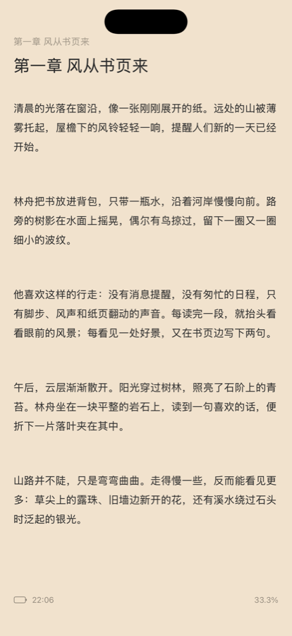
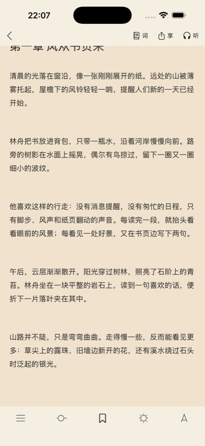
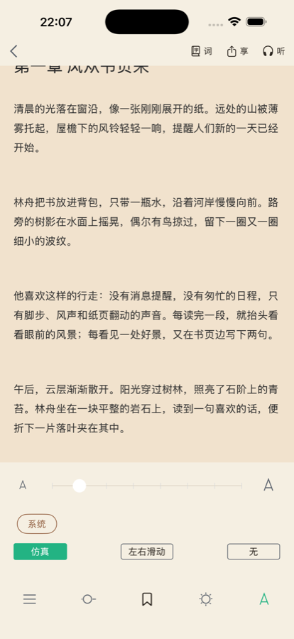
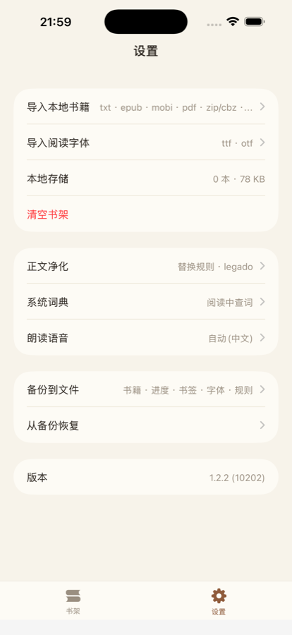
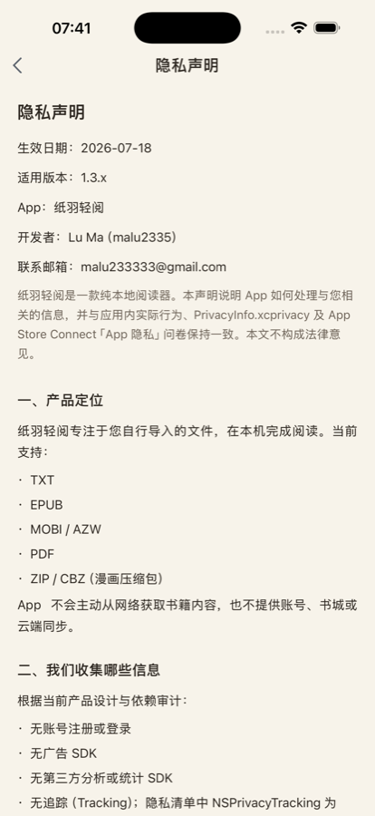
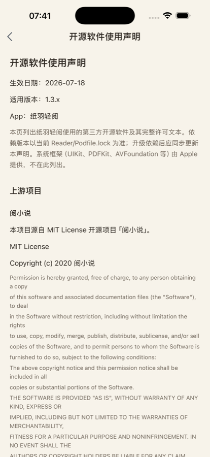

# 纸羽轻阅（reader-ios）

本地优先的 iOS 阅读器。在 [阅小说开源 iOS 客户端](https://github.com/yuenov/reader-ios) 基础上演进，专注**本地书导入、阅读体验、AI 翻译与备份**。产品路径只有 **书架 + 设置** 两个入口，在线书城相关模块已从工程中移除。

| 项 | 说明 |
|----|------|
| 应用名 | **纸羽轻阅**（`CFBundleDisplayName`） |
| 版本 | 1.15.1 |
| Bundle ID | `xyz.malu2335.reader` |
| 语言 | Objective-C |
| 最低系统 | iOS 15.0 |
| 设备 | 仅 iPhone |
| 依赖管理 | CocoaPods（14 个依赖） |
| 数据 | WCDB（SQLite）+ Keychain（AI 密钥） |
| 仓库 | https://github.com/malu2335/reader-ios |

---

## 界面预览

图源见仓库 `Screenshots/`；App Store 全尺寸导出放在本地 `AppStoreScreenshots/`（默认不进 Git）。

| 书架 | 正文阅读 | 阅读工具 |
|:---:|:---:|:---:|
|  |  |  |
| 本地书封面网格 · 导入入口 | 纸色正文 · 进度与章节 | 目录 / 书签 / 亮度 / 字号 |

| 排版设置 | 应用设置 | 正文净化 |
|:---:|:---:|:---:|
|  |  |  |
| 字号 · 字体 · 翻页动画 | 导入 · AI · 备份 · 隐私/开源入口 | legado 风格替换规则 |

| 隐私声明 | 开源软件使用声明 |
|:---:|:---:|
|  |  |
| 设置内本地文档 | 完整许可与归属 · 可滚动复制 |

> 截图可能略滞后于当前版本（例如阅读页顶栏已移除「词典」按钮）。

---

## 主要能力

### 本地阅读
- 导入 **TXT / EPUB / MOBI / AZW / PDF / ZIP / CBZ**，以及**包含图片的文件夹**（打包为 CBZ 入库）
- 支持系统「用其他应用打开 / 分享」到纸羽轻阅（复制进沙盒，不修改源文件）
- ZIP/CBZ 按文件名自然序浏览图片；PDF 走 PDFKit 独立阅读器
- 章节解析后全量存入 WCDB；`bookId < 0` 标识本地书
- 按内容哈希去重，重复导入会明确提示
- 阅读进度（章节 + 页码 + 字符偏移）、**书签**；PDF/漫画按页码记录
- 正文净化替换规则（legado 风格）
- 书架长按菜单、类型化分享卡片

### AI 翻译
- 多配置档案：OpenAI / Anthropic / Gemini 官方与兼容端点（自定义 Base URL）
- 阅读页句级翻译，译文**内嵌在原文下方**（非弹窗）
- 翻译模式跨翻页保持；后台批量预译，**停止后会真正取消在途请求**，不再继续计费
- **API Key 仅存 Keychain**；磁盘配置与备份 zip **不含明文密钥**
- 备份恢复来的 profile 一律标记为**待确认**，不会自动生效对外发请求
- 公网 Base URL 强制 HTTPS；仅回环 / 局域网 / `.local` 允许 HTTP（本地 Ollama 等）

### 朗读与设置
- 系统 `AVSpeech` 朗读条；语音选择、收藏、个人声音导入指引
- 自定义字体导入
- 备份 / 恢复（布局参考 legado：`bookshelf.json` / `config.json` / `books/`，并含 AI 元数据）
- 设置内可查看**隐私声明**与**开源软件使用声明**（随包发布的本地文本）

### 数据完整性
本地书的导入、恢复、删除都经过一轮系统性整改，核心约定如下：

- **单事务提交**：章节表与读记录表的写入合并进同一个数据库事务，失败整体回滚，不会出现「源文件在、书架无此书」或「有孤儿章节」的混合状态
- **统一变更队列**：导入 / 删除 / 清空 / 恢复共用同一条串行队列，通知只在完整提交后发出
- **恢复走 staging**：源文件先落 `RestoreStaging/<uuid>/`，解析成功、事务提交后才原子移入正式路径；任一步失败都把旧文件放回，保证每本书只可能是**完整旧状态或完整新状态**
- **错误可见**：数据库写失败会向上传播并提示用户；查询失败与「确实为空」严格区分，不会把数据库错误显示成空书架
- **导入预算**：TXT/MOBI/EPUB/CBZ 按格式设硬上限，恶意或超大文件给出明确错误而非 OOM

---

## 环境要求

- macOS + **Xcode**（在 Xcode 26 上验证；`Podfile` 的 `post_install` 含 WCDB / YYText 的 clang 兼容补丁）
- [CocoaPods](https://cocoapods.org/)
- iOS **15.0+** 模拟器或真机（iPhone）

---

## 快速开始

```bash
git clone https://github.com/malu2335/reader-ios.git
cd reader-ios/Reader
pod install
open Reader.xcworkspace
```

在 Xcode 中选择 **Reader** scheme，目标选模拟器或真机，Run。

### 测试

工程有两套测试，作用不同：

**1. XCTest（真正跑代码）**

```bash
cd Reader
xcodebuild -workspace Reader.xcworkspace -scheme Reader \
  -sdk iphonesimulator -destination 'platform=iOS Simulator,name=iPhone 17 Pro' \
  -only-testing:ReaderTests test
```

覆盖导入事务、备份恢复的故障注入、删除清空、数据库事务、AI 翻译取消、控件接线等。

> ⚠️ 单元测试注入宿主 app 进程运行，**与 app 共用同一个模拟器容器**，`setUp` 会清空书库。如果同一台模拟器上有手动测试的数据，请换一台跑测试。

**2. 静态断言 harness（bash + python，只读源码）**

```bash
cd Reader
bash Tests/AIHarness/run_tests.sh              # AI 协议 / 备份脱敏 / Base URL 策略
bash Tests/ExternalImportHarness/run_tests.sh  # 外部文件导入的 Info.plist 声明
bash Tests/LegalDocumentsHarness/run_tests.sh  # 隐私 / 开源声明文档
bash Tests/LibraryMutationHarness/run_tests.sh # 单事务提交、staging、串行队列等不变量
bash Tests/PhaseCHarness/run_tests.sh          # 业务一致性与 schema 版本等不变量
```

这类 harness 把关键约定钉在源码层面（例如「导入必须走 RDLibraryTransaction 提交」），防止重构时被悄悄改掉。除 AIHarness 外都不编译代码，**挡不住运行时缺陷**——数据链路改动仍需跑 XCTest 并在模拟器上人工过一遍。

### libwebp 下载失败

若 `pod install` 因访问 `chromium.googlesource.com` 超时，可将本地 Spec 中 libwebp 的 `source.git` 改为 GitHub 镜像后再装依赖：

```text
~/.cocoapods/repos/<主仓库>/Specs/1/9/2/libwebp/<版本>/libwebp.podspec.json
```

```json
"source": {
  "git": "https://github.com/webmproject/libwebp.git",
  "tag": "v1.1.0"
}
```

（版本号以 `Podfile.lock` 为准。）然后重新执行 `pod install`。

---

## 目录结构（摘要）

```text
reader-ios/
├── README.md
├── LICENSE                 # © 2020 阅小说；© 2026 Lu Ma / 纸羽轻阅
├── Screenshots/            # README 界面预览（已压缩，可提交）
├── AppStoreScreenshots/    # 本地 ASC 全尺寸导出（gitignore）
└── Reader/
    ├── Podfile
    ├── Reader.xcworkspace  # pod install 后打开此 workspace
    ├── Reader/             # 主工程源码
    │   ├── Application/    # AppDelegate / SceneDelegate
    │   ├── Common/
    │   │   ├── AI/         # 多厂商翻译客户端与配置
    │   │   ├── LocalBook/  # 解析器、导入预算、备份恢复、变更队列
    │   │   ├── Read/       # 分页与章节
    │   │   └── Speech/     # 朗读
    │   ├── Database/       # WCDB 模型、Manager 与跨表事务
    │   ├── Sections/
    │   │   ├── Bookshelf/  # 书架与阅读器
    │   │   └── Setting/    # 设置、AI 配置、净化规则、语音
    │   └── Resource/       # Info.plist、隐私/开源声明、图标
    └── Tests/
        ├── ReaderTests/    # XCTest 单元测试
        ├── ReaderUITests/  # XCUITest 主路径
        └── *Harness/       # 静态源码断言脚本
```

---

## 隐私与密钥

- **不要**把真实 API Key、备份 zip、个人书库数据库、模拟器截图提交进 Git
- AI Key：Keychain 服务名 `reader.ios.ai.apikey`；备份中的 `ai_config` 仅元数据（`apiKey` 为空）
- 设置页可查看随包发布的隐私声明与开源许可全文
- 已在 `.gitignore` 中忽略：`docs/`、审查与计划报告（`code-review/`、`*-review-*.md` 等）、`CLAUDE.md`、`.cursor/`、`.DS_Store`、根目录截图
- 推送前建议自检：`git diff` / `git grep` 是否含 `sk-`、私钥、本机绝对路径等

---

## 与上游的关系

本仓库基于阅小说 iOS 开源客户端演进。**发现 / 书库 / 搜索 / 书籍详情 / 在线目录 / 下载 与整个 `Service/` 网络层已从工程中删除**（128 个文件），相应的 `JLRoutes`、`MJRefresh`、`WMPageController`、`YTKNetwork`、`NJKWebViewProgress`、`AFNetworking` 依赖也已移除。当前工程只保留本地阅读所需代码。

| 资源 | 链接 |
|------|------|
| 本仓库 | https://github.com/malu2335/reader-ios |
| 上游 iOS | https://github.com/yuenov/reader-ios |
| 上游 API 文档 | https://github.com/yuenov/reader-api |
| 上游 Android | https://github.com/yuenov/reader-android |

原「阅小说」产品与商店分发信息请以上游及官方渠道为准；本仓库为**独立维护的本地优先衍生版本**，应用展示名为 **纸羽轻阅**。

---

## 声明

- 本客户端只做**本地文件阅读**，AI 翻译使用用户自备的服务与密钥，不含任何自有服务端
- 请勿将本项目用于侵犯著作权或其他违法行为；用户导入的内容与配置的 AI 密钥由用户自行负责
- 软件按 MIT 许可提供，详见 [LICENSE](LICENSE)。本衍生版本保留上游「阅小说」版权声明，并增加 2026 年 Lu Ma（纸羽轻阅）版权行
